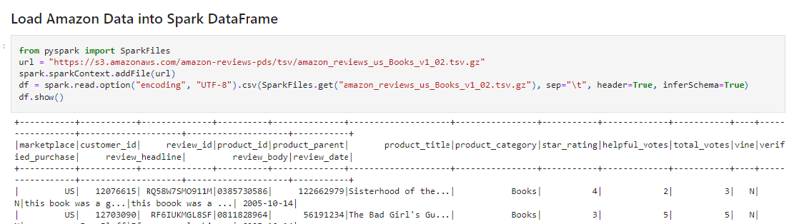
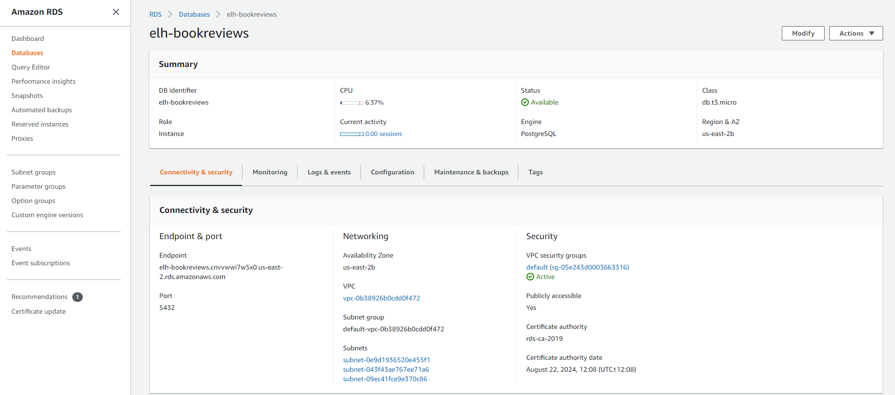
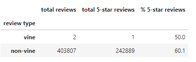

# Amazon Vine Analysis
## Overview of the Analysis
An analysis of the Amazon reviews written by members of the paid Amazon Vine program was performed to see if there is any bias toward favorable reviews from Vine members. The Amazon Vine program is a service that allows manufacturers and publishers to receive reviews for their products. Companies pay a small fee to Amazon and provide products to Amazon Vine members, who are then required to publish a review.

## Coding
For this analysis a book review dataset was chosen, with reviewers given books ratings from one to five stars.  Sampling the dataset revealed that the books appeared to span all genres of fiction and non-fiction.  PySpark was used to perform the ETL process in order to extract the dataset, transform the data, connect to an AWS RDS instance, and load the transformed data into pgAdmin. Pandas was then used to determine if there was any bias toward favorable reviews from Vine members in the dataset. A summary of the results and suggestions for future analyses can be found below.

The screenshot below shows a portion of the Python code created in Colab and referencing PySpark in order to extract the book review dataset.  After downloading the data it is placed into a dataframe where it is cleaned and filtered.  

The screenshot below shows the AWS RDS instance which was used to route the cleaned data from the Colab notebook to into a postgres database.  After this, pgAdmin software was used to export the cleaned data to a cvs file so it could be used on a local machine

## Results
The results of book reviews analysis can be seen in the table below.  From a dataset containing 

## Summary
 

